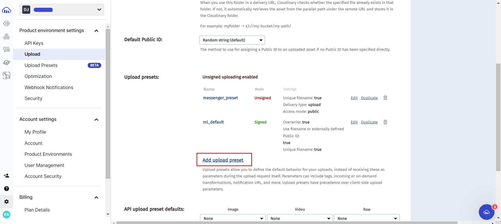

# A Guide on Next Cloudinary :sparkles:

Next Cloudinary is a community-developed library that allows us to integrate Cloudinary in a Next.js project tailored for image and video delivery and uploading.

## Getting started 🚀

### 1. Install the package

You can use any package manager to install the cloudinary Next.js SDK

```sh
npm install next-cloudinary
           or
yarn add next-cloudinary
```

### 2. Create an account on Cloudinary platform

-   Visit cloudinary.com and create an account.
-   In the tabs sidebar on the left-hand side, click on _Programmable Media_ icon


-   Select _Dashboard_
-   Copy the **cloud name** and store it as an _environment variable_ in an `.env` or `.env.local` file as:

<br/>

```sh
NEXT_PUBLIC_CLOUDINARY_CLOUD_NAME=<your_cloud_name>
```

### 3. Create an upload preset

We need to now create an **upload preset** on our cloudinary platform.

Upload presets are predefined sets of rules and configurations in our Cloudinary account that determine how files should be uploaded (e.g. resizing images, applying transformations, setting security rules).

Steps:

-   Go to _Settings_
-   Cick on _Upload_ from the left sidebar.
-   Scroll down to upload presets section and click on _Add upload preset_. Fill in the name and other details and click _Save_.



## Using the package in code 💻

In this section, I will explain how I've used this package in this code to upload images to cloudinary.

In the `MessageInputField.tsx` file, I've used these steps :

### 1. import `CldUploadButton`

At the top, import `CldUploadButton` from _next-cloudinary_ package

```js
import { CldUploadButton } from "next-cloudinary"
```

### 2. Wrap `CldUploadButton` around the photo icon

`CldUploadButton` is a custom component provided by the next-cloudinary package. It creates an upload button using an instance of _Cloudinary Upload Widget_ to allow users to easily upload files to Cloudinary.

```js
<CldUploadButton options={{ maxFiles: 1 }} onSuccess={imageUploadHandler} uploadPreset='messenger_preset'>
    <HiPhoto />
</CldUploadButton>
```

-   **options={{maxFiles: 1}} :** The options prop is used to pass configuration options. Here, I've restricted the upload to a maximum of one file at a time.

-   **onSuccess={imageUploadHandler} :** handles the upload completion event. It calls `imageUploadHandler` callback function after the image is uploaded to cloudinary.

-   **uploadPreset="messenger_preset" :** prop is used to specify a Cloudinary upload preset. Here, we pass the name of the upload preset we created previously.

### 3. Creating `imageUploadHandler` function

This function accepts the _uploaded image details_ as argument which is an **object** of type `CloudinaryUploadWidgetResults` (imported from next-cloudinary package itself).

```js
import type { CloudinaryUploadWidgetInfo, CloudinaryUploadWidgetResults } from "next-cloudinary"
```

`imageUploadHandler` retrieves the _secure_url_ from the argument and makes a POST call to store this data in the Message collection of our mongodb database.

```js
// a function to upload image to cloudinary and store its url in the database via /api/messages POST endpoint
const imageUploadHandler = async (result: CloudinaryUploadWidgetResults) => {
    const uploadInfo = result?.info as CloudinaryUploadWidgetInfo
    const uploadURL = uploadInfo.secure_url

    try {
    const response = await axios.post("/api/messages", {
        image : uploadURL,
        conversationId,
    })

    if (response.status !== 200) throw new Error("Failed to upload image")

    } catch (error) {
    handleRequestError(error)
    }
}
```
