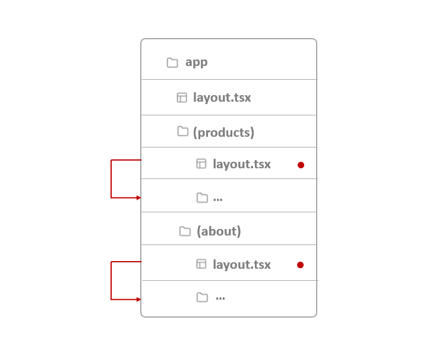

# Next.js Coding Hacks & Best practices :sparkles:

This readme is a collection of coding hacks and best practices for working with Next.js that I learnt while building this project.

## Table of Contents 📑

-   [Coding Hacks](#coding-hacks-🔓) :unlock:
    -   [1. Route Groups](#2-private-folder-📁) 🗺️
    -   [2. Private Folder](#2-private-folder-📁) :file_folder:
    -   [3. getServerSession vs getSession vs useSession](#3-getserversession-vs-getsession-vs-usesession-🕒)🕒
-   [Best Practices](#best-practices-🥇) 🥇
    -   [1.\<Image> Component](#1-image-component-🖼️) 🖼️
    -   [2. useCallback Hook](#2-usecallback-hook-⚛️) ⚛️
    -   [3. useMemo Hook](#3-usememo-hook-️⚛️) ⚛️
    -   [4. import vs import type](#4-import-vs-import-type-📦) 📦

## Coding Hacks :unlock:

### 1. Route Groups 🗺️

In NextJS, any folder inside app folder are mapped to a URL path. We can wrap a _folder's name_ with parenthesis to indicate that this folder is just for better organization and should not be included in the route.


As seen in the above image, folders _products_ and _about_ are omitted from their subfolder's URL paths.

We can also add separate `layout.tsx` files for these folders even though their subfolders share the same URL hierarchy.



-   **(site) :** I have used `(site)` route group to group together my main `page.tsx` and its related components.

### 2. Private Folder :file_folder:

We can indicate private folders by prefixing them with an **underscore**: `_foldername`.

-   **\_components :** I've renamed my components folders to `_components` to indicate it as a folder used to separate UI logic from routing. Hence it and its subfolders should not be used in routing.

Other folders like **\_hooks**, **\_libs**, **\_context** are also named as private folders to exclude them and their sub folders from routing.

### 3. getServerSession vs getSession vs useSession 🕒

**useSession :** It is a hook provided by the `next-auth` library. It is used to fetch the current user's session details. It also provides helper functions for setting active session.

-   Works only when `<SessionProvider>` is added to layout file.

-   Since it is a hook, it can only be used on **client components** and follows the _Rules for Hooks_ that is they can only be defined at topmost level of functional components.

-   It returns the session object whether or not the user is logged in that is whether or not the cookies are present.

**getSession :** It is a helper function that should be used only on **client side** to get the current active session.

-   As it is a helper function, it doesn't follow hooks' rules and can be used inside other function to get session object. It returns _null_ if no session exists.

**getServerSession :** It is also a helper function to get current session object just like _getSession_

-   It is recommended to use on the **server side** i.e. in route handlers, api routes, server components etc

-   It returns the session object only when user has logged in and returns _null_ otherwise.

## Best Practices 🥇

### 1. \<Image> Component 🖼️

Always use the `<Image>` component to render images in NextJS.

-   use `placeholder="blur"` attribute to show a blurred version of the image until it loads.
-   use `quality` attribute to define the quality of the image. It accepts a number between 1 to 100. 1 being the lowest quality and 100 the highest.
-   set `priority` to true for Largest Contentful Paint element if it appears above the fold. Image component lazy loads all images by default. By setting this attribute to true, it will preload that particular image.

> Above the fold refers to the part of a web page visible before a user scrolls down.

> Largest Contentful Paint (LCP) is a user experience (UX) metric. It’s the time it takes between the browser starting to load a page and the largest content element (image or text block) on that page appearing on the screen.

### 2. useCallback Hook ⚛️

useCallback is a react hook that is used to memoize **callback functions** that only changes if one of the dependencies has changed.

> A callback function is a function that is passed to another function as an argument.

In case of useCallback, it returns a memoized function to prevent it from being recreated on every render thus it helps in optimizing an application's performance.

Use this hook to memoize callback functions that:

-   are passed to child components.
-   are used in other contexts, such as event handlers and timers.
-   rely on external data or state.
-   when they are called from useEffect hook and are thus a dependency for it.

:link: [Read about memoization]()

### 3. useMemo Hook ⚛️

useMemo is a react hook that is used to memoize a **value**. Just like useCallback, it also takes in _2 arguments_ — a function and an array of dependencies.

Here the function _must_ return a value which is then memoized by useMemo() hook.

Use this hook when:

-   when the computation is resource-intensive and time consuming
-   to maintain [referential equality]() between renders to avoid unnecessary re-renders

useMemo() helps to maintain referential equality by memoizing the result of a computation and ensuring that the **same reference** is returned across renders, as long as the dependencies haven't changed.

This is particularly useful when dealing with _objects_, _arrays_, that are passed as props to child components or used in dependency arrays of hooks like useEffect or useCallback.

Even when the values of an object or array _hasn't changed_, a new object or array created on a re-render will have a different memory address which in turn calls the useEffect hooks again. useMemo() helps to avoid this.

### 4. import vs import type 📦

**import ... from :** The standard `import` statement is used to import both types and values (e.g. functions, classes, variables) from a module. This includes anything that is actually part of the runtime JavaScript code.

```js
import { FullConversation } from "@/app/_types"
```

Here, `FullConversation` could be a type, interface, or a value that exists at runtime.

Using _import_ means that TypeScript will not strip out the imports during transpilation to JavaScript, even if it's only a type.

**import type ... from :** The import type statement is used to import only types or interfaces from a module.

```js
import type { FullConversation } from "@/app/_types";
```

Here, FullConversation is explicitly imported as a type.

TypeScript removes these imports during the transpilation process because they have no impact on the runtime behavior of the code. This can lead to smaller JavaScript bundles and avoid potential issues with unused imports.

Where to use `import type`?

-   If the thing we're importing doesn't have a value, using a value import will in some cases be interpreted as an error, because most JS tooling doesn't know that Flow exists.

```js
export type Foo = { prop: number };
```

Here, Foo should only be imported with `import type { Foo } from ...`, since there is no value named **Foo**, it is just a type

-   If the thing we're importing has a JS value, but all we want is the type

-   Importing only the type can make code more readable, because it is clear from the imports that only the type is used

-   Sometimes importing only the type allows us to avoid dependency cycles in the files. Depending on how code is written, it can sometimes matter what order things are imported in. Since `import type ...` only influences typechecking, and not runtime behavior, we can import a type without actually requiring the imported file to execute, avoiding potential cycles.
