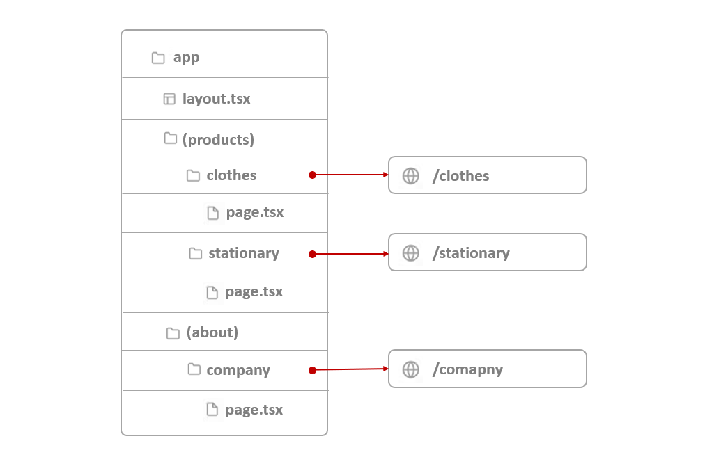

# Next.js Coding Hacks :sparkles:

This readme is a collection of coding hacks and best practices for working with Next.js that I learnt while building this project.

## Table of Contents 📑

-   [Coding Hacks](#coding-hacks-🔓) :unlock:
    -   [1. Route Groups](#2-private-folder-📁) 🗺️

## Coding Hacks :unlock:

### 1. Route Groups 🗺️

In NextJS, any folder inside app folder are mapped to a URL path. We can wrap a _folder's name_ with parenthesis to indicate that this folder is just for better organization and should not be included in the route.

As seen in the above image, folders _products_ and _about_ are omitted from their subfolder's URL paths.

We can also add separate `layout.tsx` files for these folders even though their subfolders share the same URL hierarchy.

-   **(site) :** I have used `(site)` route group to group together my main `page.tsx` and its related components.

### 2. Private Folder :file_folder:

We can indicate private folders by prefixing them with an **underscore**: `_foldername`.

-   **\_components :** I've renamed my components folders to `_components` to indicate it as a folder used to separate UI logic from routing. Hence it and its subfolders should not be used in routing.
