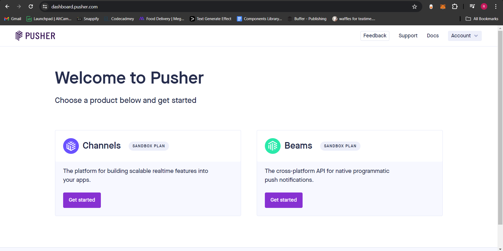

# A Guide on Pusher :sparkles:

## Getting started 🚀

### 1. Install the package

You can use any package manager to install the cloudinary Next.js SDK

```sh
npm install pusher pusher-js
           or
yarn add pusher pusher-js
```

### 2. Create an account on Pusher platform

-   Visit https://pusher.com/ and create an account.
-   Click on the "Get started" button in the _Channels_ Box to create a new channel



-   Fill in the app name and other details and click on _Create_.
-   From the right-side bar, select _App Keys_.
-   Copy the required app keys and create env variables for them in your `.env` or `.env.local` file

### 3. Create Pusher Client and Server

-   Create a pusher.ts file in the libs folder with the below code:

```js
import PusherServer from "pusher"
import PusherClient from "pusher-js"

export const pusherServer = new PusherServer({
    appId: process.env.PUSHER_APP_ID!,
    key: process.env.NEXT_PUBLIC_PUSHER_APP_KEY!,
    secret: process.env.PUSHER_SECRET!,
    cluster: 'ap2',
    useTLS: true

})

export const pusherClient = new PusherClient(
    process.env.NEXT_PUBLIC_PUSHER_APP_KEY!,
    {
        cluster: 'ap2'
    }
)
```

Get the cluster name from your _App Keys_ tab
